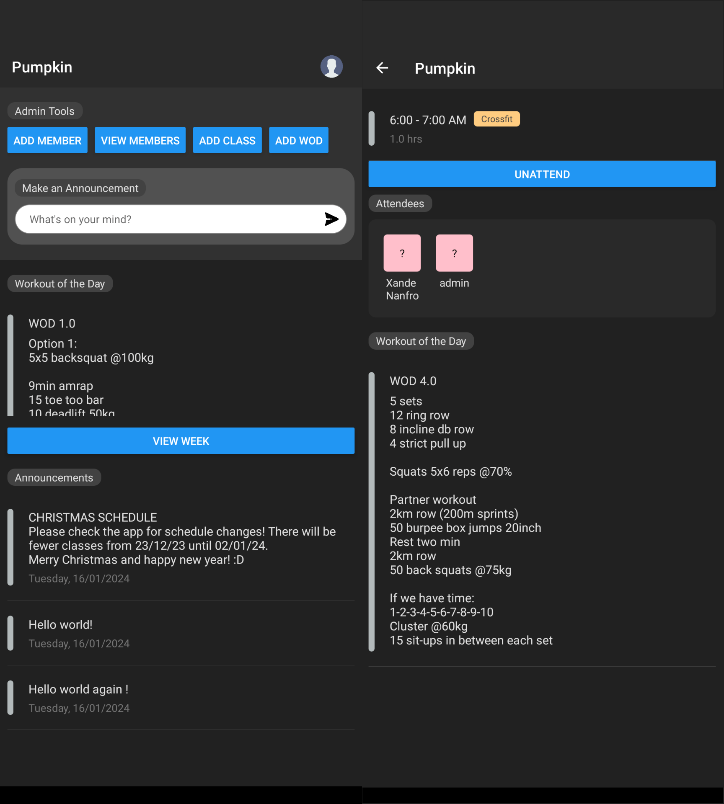

# Pumpkin

## Description

You are a gym owner that offers group training classes, and just like every established business, you need a way to communicate with your buffed up gym rats and tell them what's going on. PUMPKIN, an app with a name that makes you ask, "What does a pumpkin have to do with apps or buffed up gym rats?"... I actually do not know; but I do know that with this app, your members can:
- View the class schedule for the week, and sign in to classes.
- See their workout of the day and cry in pain as they read it.
- Access announcements saying that class is canceled because everyone at the Christmas party consumed too much alcohol (You won't announce that, but everyone knows it's true.)

## Table of Contents

1. [Developer Comments](#developer-comments)
2. [Deployed Application](#deployed-application)
3. [License](#license)
4. [Contribution](#contribution)
5. [Attributions](#attributions)
6. [Questions](#questions)

## Developer Comments

X

## Deployed Application

A video walkthrough is available at the following link: X

## License

 
This project is covered under the MIT License and is not for commercial use. It is for personal use only.

## Contribution

x4ndez: <https://github.com/x4ndez>

## Attributions

Flaticon attributions in compliance with [Flaticon-supplied guidelines](https://support.flaticon.com/s/article/Attribution-How-when-and-where-FI?language=en_US&_ga=2.76949014.2084137386.1701556714-959030861.1701556714&_gl=1*l8igym*fp_ga*OTU5MDMwODYxLjE3MDE1NTY3MTQ.*fp_ga_1ZY8468CQB*MTcwMTU2MjEyNC4zLjEuMTcwMTU2MjM1MS42MC4wLjA.*test_ga*OTU5MDMwODYxLjE3MDE1NTY3MTQ.*test_ga_523JXC6VL7*MTcwMTU2MjEyNC4zLjEuMTcwMTU2MjM1MS41OC4wLjA.)

- [Profile icon located in header created by Smashicons - Flaticon](https://www.flaticon.com/free-icons/user) 
- [Send icon created by Amazona Adorada - Flaticon](https://www.flaticon.com/free-icons/send) 
- [Password visible icon located on login screen created by th studio - Flaticon](https://www.flaticon.com/free-icons/password) 
- [Delete icon created by Pixel perfect - Flaticon](https://www.flaticon.com/free-icons/delete) 

## Questions

Questions may be directed to my LinkedIn: <https://www.linkedin.com/in/alexandernanfro/>.